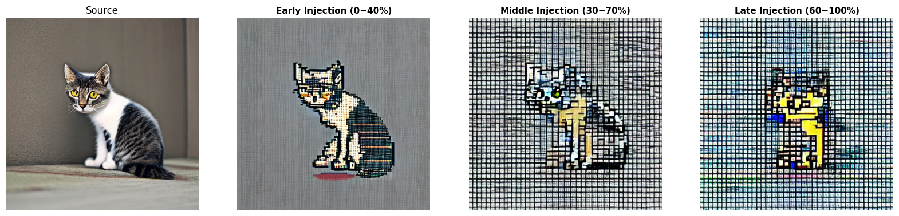

# Disentangling Structure and Style in Diffusion Models via Attention Control

[](https://www.python.org/)
[](https://pytorch.org/)
[](https://huggingface.co/docs/diffusers/index)

**📝 This repository is maintained for research recording and reference purposes.**

> **"Can we change the object identity (e.g., Cat → Tiger) while strictly preserving its pose and layout?"**

This project investigates the internal representations of Text-to-Image Diffusion Models. By selectively injecting attention maps from a source generation into a target generation, demonstrate that Self-Attention layers govern the geometric structure (spatial layout, pose), while Cross-Attention layers control the semantic content and style.

---

## 🖼️ Teaser Results

### Structure-Aware Semantic Editing (Cat → Tiger)
Transform a source cat into a tiger. Notice how the **pose, head orientation, and paw positions** are perfectly preserved, even though the semantic identity has changed.


*(Left: Source Image | **Center: Self-Attention Injection (Ours)** | Right: Cross-Attention Injection)*

> **Key Observation:** Injecting **Self-Attention only** (Center) successfully enforces the structural constraints of the source image, whereas Cross-Attention injection (Right) fails to preserve the pose, resulting in a generic tiger image biased by the model's training data.

---

## 🧪 Methodology

Introduce `GradualInjectionProcessor`, a custom attention processor that allows fine-grained control over the U-Net's information flow.

### The Hypothesis
* **Self-Attention (`attn1`):** Captures spatial relationships within the image (Structure, Layout, Shape).
* **Cross-Attention (`attn2`):** Captures the alignment between text and image features (Style, Semantics).

### The Algorithm
1.  **Inversion/Generation (Source):** Generate the source image and cache the Attention Maps ($M_{source}$) from specific layers.
2.  **Injection (Target):** During the generation of the target prompt, replace the target's Attention Maps with $M_{source}$ for the initial $T$ steps (Injection Threshold).
3.  **Memory Optimization:** To enable high-resolution analysis on limited resources (e.g., Colab), implemented a selective caching mechanism that skips computationally expensive maps ($64 \times 64$) without compromising structural fidelity.

---

## 📊 Experiments

### 1. Structure vs. Style (Cat → Robot)
Changing the texture to metallic/robotic while keeping the biological form.


* **Self-Attn Only:** The robot parts follow the exact curvature of the cat's body.
* **Cross-Attn Only:** The structure collapses into a generic sci-fi creature.

### 2. Layer-wise Ablation (Cat → Pixel Art)

Analyzed which U-Net blocks (Down, Mid, Up) contribute most to structural preservation.


* **Up-Blocks (Decoder):** Found to be the most critical for determining the final spatial layout and fine-grained details.

### 3. Temporal Dynamics (When is structure determined?)
We investigated the temporal characteristics of the diffusion process by injecting attention maps at different denoising intervals.



* **Early Injection (0~40%):** The layout and pose are preserved, confirming that **global structure is determined in the early denoising steps**.
* **Late Injection (60~100%):** The structure is not preserved, and the model generates a generic object. This suggests that later steps focus on refining high-frequency details (texture) rather than global geometry.

### 4. Head-wise Analysis (What defines structure?)
Further analysis is enabled by the `--inject_heads` argument. We can investigate if all self-attention heads contribute equally to structure.

- **Hypothesis**: Within a single SA layer (e.g., 8 heads), some heads might specialize in global pose ("pose heads") while others focus on local texture or details ("texture heads").
- **Experiment**: By injecting only a subset of SA heads, we can identify the minimal set of heads required to preserve the structural integrity of the source image.

---

## 🚀 Usage

### Installation
```bash
git clone https://github.com/ksssoyu/diffusion-structure-disentanglement.git
cd diffusion-structure-disentanglement
pip install -r requirements.txt
```

### Run Experiments (CLI)

**Experiment 1: Semantic Editing (Self vs Cross Attention)**

```bash
# Convert Cat to Tiger (Preserving Pose)
# Inject Self-Attention from 0% to 80% of steps
python main.py --experiment_type attention \
  --prompt_a "A photo of a cute cat looking at the camera, highly detailed" \
  --prompt_b "A tiger sitting on the floor, wild animal photography" \
  --start 0.0 --end 0.8
```

**Experiment 2: Style Transfer (Layer-wise Analysis)**

```bash
# Convert Cat to Pixel Art
python main.py --experiment_type layer \
  --prompt_b "A pixel art character of a cat, 8-bit style" \
  --start 0.0 --end 0.8
```

**Experiment 3: Temporal Dynamics (Time-step Analysis)**

```bash
# Investigate when the structure is determined (Early vs Late)
python main.py --experiment_type attention \
  --prompt_b "A pixel art character of a cat" \
  --start 0.0 --end 0.4  # Early Injection
```

**Experiment 4: Advanced Head-wise Injection**

```bash
# Convert Cat to Tiger, but ONLY inject Self-Attention heads 0, 2, and 4
# This tests if these specific heads are sufficient for pose preservation.
python main.py --experiment_type attention \
  --prompt_a "A photo of a cute cat looking at the camera, highly detailed" \
  --prompt_b "A tiger sitting on the floor, wild animal photography" \
  --start 0.0 --end 0.8 \
  --inject_heads 0 2 4
```

---

## 📂 Project Structure

```bash
.
├── src/
│   ├── processor.py      
│   └── utils.py         
├── main.py                
├── requirements.txt 
└── README.md        
```
