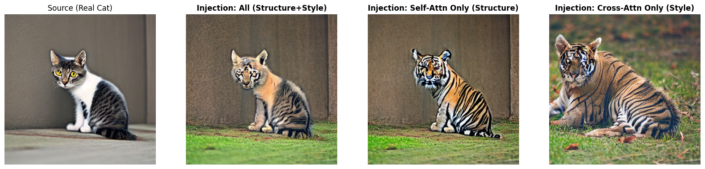
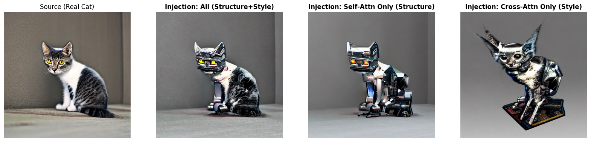
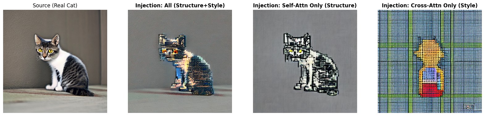

# Disentangling Structure and Style in Diffusion Models via Attention Control

[](https://www.python.org/)
[](https://pytorch.org/)
[](https://huggingface.co/docs/diffusers/index)

> **"Can we change the object identity (e.g., Cat → Tiger) while strictly preserving its pose and layout?"**

This project investigates the internal representations of Text-to-Image Diffusion Models. By selectively injecting attention maps from a source generation into a target generation, demonstrate that **Self-Attention** layers govern the geometric structure (spatial layout, pose), while **Cross-Attention** layers control the semantic content and style.

---

## 🖼️ Teaser Results

### Structure-Aware Semantic Editing (Cat → Tiger)
Transform a source cat into a tiger. Notice how the **pose, head orientation, and paw positions** are perfectly preserved, even though the semantic identity has changed.


*(Left: Source Image | **Center: Self-Attention Injection (Ours)** | Right: Cross-Attention Injection)*

> **Key Observation:** Injecting **Self-Attention only** (Center) successfully enforces the structural constraints of the source image, whereas Cross-Attention injection (Right) fails to preserve the pose, resulting in a generic tiger image biased by the model's training data.

---

## 🧪 Methodology

Introduce `GradualInjectionProcessor`, a custom attention processor that allows fine-grained control over the U-Net's information flow.

### The Hypothesis
* **Self-Attention (`attn1`):** Captures spatial relationships within the image (Structure, Layout, Shape).
* **Cross-Attention (`attn2`):** Captures the alignment between text and image features (Style, Semantics).

### The Algorithm
1.  **Inversion/Generation (Source):** Generate the source image and cache the Attention Maps ($M_{source}$) from specific layers.
2.  **Injection (Target):** During the generation of the target prompt, replace the target's Attention Maps with $M_{source}$ for the initial $T$ steps (Injection Threshold).
3.  **Memory Optimization:** To enable high-resolution analysis on limited resources (e.g., Colab), implemented a selective caching mechanism that skips computationally expensive maps ($64 \times 64$) without compromising structural fidelity.

---

## 📊 Experiments

### 1. Structure vs. Style (Cat → Robot)
Changing the texture to metallic/robotic while keeping the biological form.


* **Self-Attn Only:** The robot parts follow the exact curvature of the cat's body.
* **Cross-Attn Only:** The structure collapses into a generic sci-fi creature.

### 2. Layer-wise Ablation (Cat → Pixel Art)

Analyzed which U-Net blocks (Down, Mid, Up) contribute most to structural preservation.


* **Up-Blocks (Decoder):** Found to be the most critical for determining the final spatial layout and fine-grained details.

---

## 🚀 Usage

This repository supports both **CLI (Command Line Interface)** and **Jupyter Notebooks**.

### Installation
```bash
git clone [https://github.com/ksssoyu/diffusion-structure-disentanglement.git](https://github.com/ksssoyu/diffusion-structure-disentanglement.git)
cd diffusion-structure-disentanglement
pip install -r requirements.txt
```

### Run Experiments (CLI)

**Experiment 1: Semantic Editing (Self vs Cross Attention)**

```bash
# Convert Cat to Tiger (Preserving Pose)
python main.py --experiment_type attention \
  --prompt_a "A photo of a cute cat looking at the camera, highly detailed" \
  --prompt_b "A tiger sitting on the floor, wild animal photography" \
  --threshold 0.8
```

**Experiment 2: Style Transfer (Layer-wise Analysis)**

```bash
# Convert Cat to Pixel Art
python main.py --experiment_type layer \
  --prompt_b "A pixel art character of a cat, 8-bit style"
```

---

## 📂 Project Structure

```bash
.
├── assets/                  # Result images for README
├── output/                  # Generated experiment results
├── src/
│   ├── processor.py         # Core Logic: GradualInjectionProcessor (Memory Optimized)
│   └── utils.py             # Helper functions (Visualization, Step counting)
├── main.py                  # Main execution script (CLI support)
├── requirements.txt         # Dependencies
└── README.md                # Project Documentation
```
